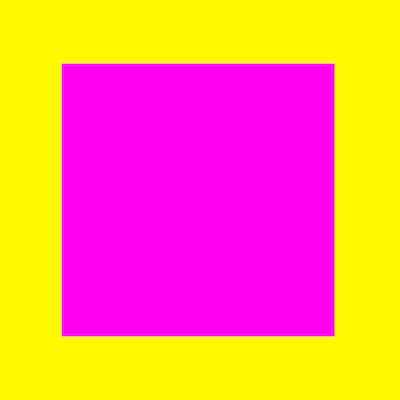
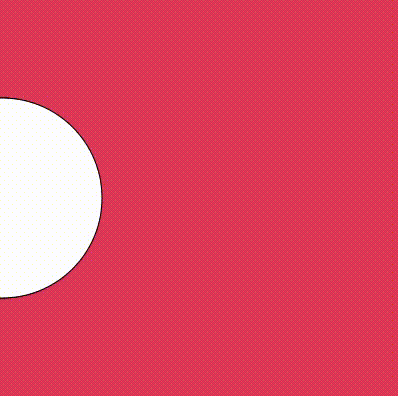
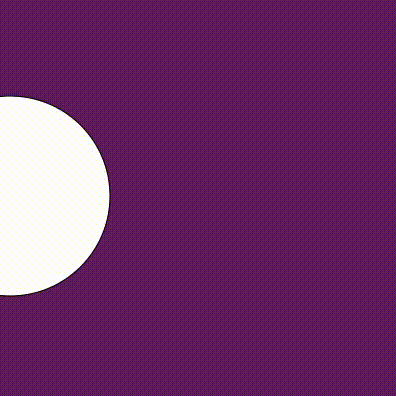
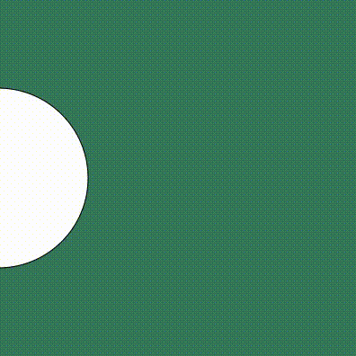
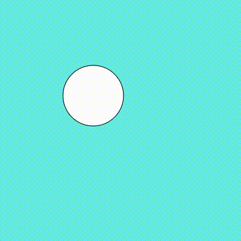

# Introduction to Programming with p5.js

## Resources
- [p5.js Reference](https://p5js.org/reference/)
- [The Coding Train](https://www.youtube.com/user/shiffman/playlists?view=50&sort=dd&shelf_id=14) – YouTube Tutorials von Daniel Shiffman
- Book (and Website) [Generative Gestaltung](http://www.generative-gestaltung.de/2/) von Benedikt Groß, Hartmut Bohnacker und Julia Laub

## Inspriration
- [Zach Lieberman - Daily Sketches](https://www.instagram.com/zach.lieberman/)
- [Lauren Mccarthy - us+](http://www.lauren-mccarthy.com/us)
- [onformative - Porsche Backbox](https://onformative.com/work/porsche-blackbox)
- [Kyle McDonald - Sharing Faces](https://vimeo.com/96549043)
- [Andreas Nicolas Fischer - VOID VIII 01](http://studioanf.com/v0id-8/)
- [Waltz Binaire - Soap and Milk](http://waltzbinaire.com/work/soap-and-milk/), openframeworks + vvvv
- [Facadeprinter](http://sonicedevelopment.com/vamos-rafa/)
- [So Kanno - Lasermice](http://kanno.so/lasermice/)
- [Benjamin Maus - Jller](https://vimeo.com/167126696)

## Sessions
### N°1 08.12.2018
- Introduction Round 
	- background, programming experience, interests
- Overview of what we're going to do
- Intro to p5.js
	- [what is p5.js](http://hello.p5js.org)
	- [Web Editor](https://editor.p5js.org)
	- setup() and draw()
 	- comments
	- createCanvas()
	- ellipse()
	- [coordinate system](https://p5js.org/learn/coordinate-system-and-shapes.html)
	- rect()
	- stroke, fill
	- mouseX, mouseY
	- if/else, mouseIsPressed
	- background -> difference between setup and draw

#### Challenge 1: Color Rectangle

We want to accomplish something like [this](http://www.generative-gestaltung.de/2/sketches/?01_P/P_1_0_01).

1. Draw a rectangle in the middle of the canvas -> use the function [rectMode](https://p5js.org/reference/#/p5/rectMode) and [width](https://p5js.org/reference/#/p5/width) for this.
2. Make the rectangle scale with the x-position of the Mouse. It should be exactly as big as the canvas when the mouse is at the right end of the canvas. Use mouseX and [width](https://p5js.org/reference/#/p5/width)  to accomplish this.
3. Change the background color depending on the y-coordinate of the mouse.
4. Use [colorMode(HSB)](https://p5js.org/reference/#/p5/colorMode) to make the background-color change more smoothly.
5. Change the color of the rectangle in the opposite direction. Background and rectangle should have the same color in the middle of the canvas.

#### Challenge 2: Bouncing Ball
1. Make a circle move from one side of the screen to the other. Use a global variable for this.  

2. Make it go back when it hits the right border of the canvas. Use a speedX variable to accomplish this.   

3. Let it bounce back on the left border as well. Use an OR statement (||) for this.  

4. Make it also bounce on the top and bottom of the canvas.  

5. Change the color of the backgroud or the ball every time a wall is hit.

### Additional Topics 
- [more interactivity](https://p5js.org/learn/interactivity.html)
	- keyIsPressed
	- pmouseX, pmouseY
- binary logic 
- arrays
- translate/rotate/scale
	- push/pop
- print
- [colors](https://p5js.org/learn/color.html) / hsb
- random & noise
- variables
	- global vs lokal
- functions
- javascript objects 
- classes
- conditionals
- bouncing balls
- loops
	- loop-in-loop
- images
- sound
- 3d
- APIs
- running p5js locally
- serving from a server
- [backend-stuff](https://github.com/processing/p5.js/wiki/p5.js,-node.js,-socket.io)
- libraries
- [p5.dom library](http://p5js.org/reference/#/libraries/p5.dom), [beyond the canvas](https://github.com/processing/p5.js/wiki/Beyond-the-canvas)

	
	
	

