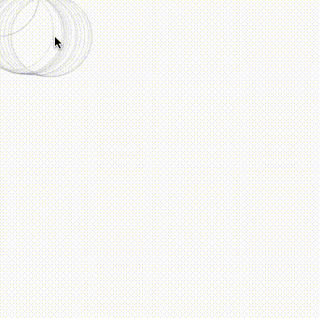
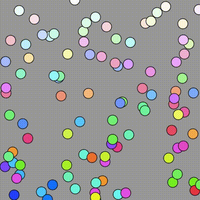
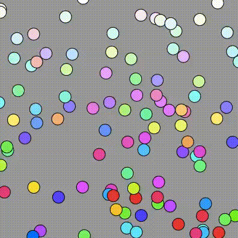
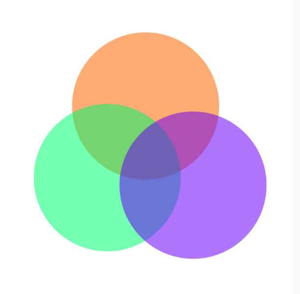
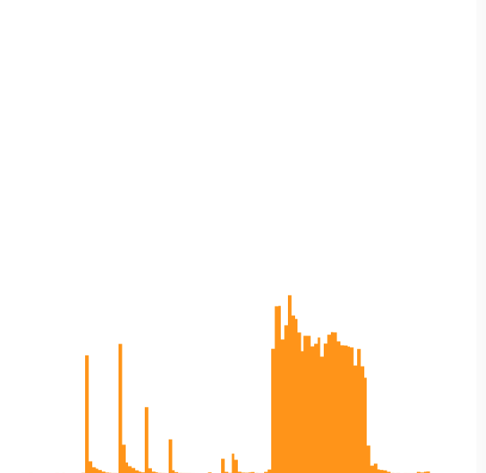
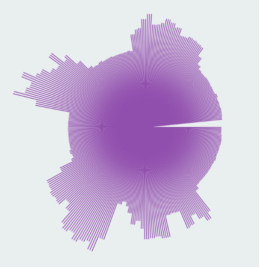

# Introduction to Programming with p5.js

## Courses
* Weekend #1: 8. & 9.12.2018
* Weekend #2: 12. & 13.01.2019

## Resources
- [p5.js Reference](https://p5js.org/reference/)
- [The Coding Train](https://www.youtube.com/user/shiffman/playlists?view=50&sort=dd&shelf_id=14) – YouTube Tutorials von Daniel Shiffman
- Book (and Website) [Generative Gestaltung](http://www.generative-gestaltung.de/2/) von Benedikt Groß, Hartmut Bohnacker und Julia Laub

## Inspriration
- [Zach Lieberman - Daily Sketches](https://www.instagram.com/zach.lieberman/)
- [Lauren Mccarthy - us+](http://www.lauren-mccarthy.com/us)
- [onformative - Porsche Blackbox](https://onformative.com/work/porsche-blackbox)
- [Kyle McDonald - Sharing Faces](https://vimeo.com/96549043)
- [Andreas Nicolas Fischer - VOID VIII 01](http://studioanf.com/v0id-8/)
- [Waltz Binaire - Soap and Milk](http://waltzbinaire.com/work/soap-and-milk/), openframeworks + vvvv
- [Facadeprinter](http://sonicedevelopment.com/vamos-rafa/)
- [So Kanno - Lasermice](http://kanno.so/lasermice/)
- [Benjamin Maus - Jller](https://vimeo.com/167126696)

## Day 1 / 08.12.2018
- Introduction Round
	- background, programming experience, interests
- Overview of what we're going to do
- Intro to p5.js
	- [what is p5.js](http://hello.p5js.org)
	- [Web Editor](https://editor.p5js.org)
	- setup() and draw()
 	- comments
	- createCanvas()
	- ellipse()
	- [coordinate system](https://p5js.org/learn/coordinate-system-and-shapes.html)
	- rect()
	- stroke, fill
	- mouseX, mouseY
	- if/else, mouseIsPressed
	- background -> difference between setup and draw

### Challenge 1: Color Rectangle

We want to accomplish something like [this](http://www.generative-gestaltung.de/2/sketches/?01_P/P_1_0_01).

1. Draw a rectangle in the middle of the canvas -> use the function [rectMode](https://p5js.org/reference/#/p5/rectMode) and [width](https://p5js.org/reference/#/p5/width) for this.
2. Make the rectangle scale with the x-position of the Mouse. It should be exactly as big as the canvas when the mouse is at the right end of the canvas. Use mouseX and [width](https://p5js.org/reference/#/p5/width)  to accomplish this.
3. Change the background color depending on the y-coordinate of the mouse.
4. Use [colorMode(HSB)](https://p5js.org/reference/#/p5/colorMode) to make the background-color change more smoothly.
5. Change the color of the rectangle in the opposite direction. Background and rectangle should have the same color in the middle of the canvas.

### Challenge 2: Bouncing Ball
1. Make a circle move from one side of the screen to the other. Use a global variable for this.  

2. Make it go back when it hits the right border of the canvas. Create an speedX variable to accomplish this. 

3. Let it bounce back on the left border as well. Use an OR statement (||) for this.  

4. Make it also bounce on the top and bottom of the canvas.  

5. Change the color of the backgroud or the ball every time a wall is hit.

## Day 2 / 09.12.2018

### Recap Challenge
Make an app that draws a circle where the mouse is. When you press the mouse, the circle should be replaced by a square.  

### Translate & Rotate

### Bubble 
* 07-random-bubble
* 08-bubble-class
* 09-same-same-but-different
* 10-bubble-array

### Challenge 3
* Make all bubbles move in the same direction  

* Make them move at different speeds  

* Make the speed variable a vector using [createVector](https://p5js.org/reference/#/p5/createVector)
* add a `setDirection` function to the Bubble class that allows to set the direction of each bubble by an angle. use [p5.Vector.fromAngle](https://p5js.org/reference/#/p5.Vector/fromAngle) for this.
* give the bubbles random speeds after setting the direction
* add a [slider](https://p5js.org/reference/#/p5/createSlider) to set the direction

## Day 3 / 12.01.2019

### Recap 
A short walk through what we've done in the first sessions. Questions? What should be explained again?

### Outline for this weekend class
In the last weebend course we've been looking at basic programming concepts and applied them in simple examples. This weekend we'll turn this around: We'll look at possible applications and see how you can realize them. For example:
* Generative Logos 
* Data Visualization
	* visualizing sound and music
	* getting data from an api and visualizing the current weather
* Image Processing
	* working with images
* Interfaces
	* analyzing live input from the camera
* Websites
	* DOM manipulations
	* publishing your code

More ideas:
* Typography
* 3D
* Browser Extensions

### Generative Logos
#### Inspiration
* https://www.behance.net/gallery/24980545/Dynamic-Identity-for-Startup-Academy
* MIT Media Lab http://www.rt80.net/medialab/
* actelion imagery wizard https://onformative.com/work/actelion-imagery-wizard

#### Simple Example
[Simple Logo Code](code/14-logo.js)  

### Data Visualization
#### Inspiration
* https://onformative.com/work/skype-visualization
* https://www.fastcompany.com/3026292/ben-fry-makes-your-sweaty-fuelband-runs-look-gorgeous#7
* https://datavizproject.com

#### Visualizing Sound
* Tutorial by Dan Shiffman: https://www.youtube.com/watch?v=Pn1g1wjxl_0&list=PLRqwX-V7Uu6aFcVjlDAkkGIixw70s7jpW
* Getting Data from the microphone and drawing a graph according to the volume => [15-sound-viz.js](code/15-sound-viz.js)  
 
* Visualizing it in a circular way => [16-sound-round.js](code/16-sound-round.js)  
 

#### Visualizing Data from APIs
* [12-get-weather-api.js](code/12-get-weather-api.js)  
* [13-weather-to-bubble.js](code/13-weather-to-bubble.js)  
* [17-rijksmuseum-api.js](code/17-rijksmuseum-api.js)  

### Image Processing
* Loading and displaying images [18-load-image.js](code/18-load-image.js)  
* looking at individual pixels [19-loadpixels.js](code/19-loadpixels.js)  
* drawing something based on the pixels [20-pointilism.js](code/20-pointilism.js)
* Computer Vision examples: https://github.com/kylemcdonald/cv-examples
* API Based Computer Vision: https://github.com/julianadenauer/khb-ss18-cognitiveservices/tree/master/session2/08-visionapi

### Interfaces
* working with live input from the camera (see above)
* speech recognition with p5.speech

### Websites
#### References
* [p5.dom library](http://p5js.org/reference/#/libraries/p5.dom), [beyond the canvas](https://github.com/processing/p5.js/wiki/Beyond-the-canvas)
* running p5js locally & from a server https://github.com/processing/p5.js/wiki/Local-server

### Browser Extensions
#### Examples
girlsvsgit https://github.com/wheresaddie/girlsvsgit